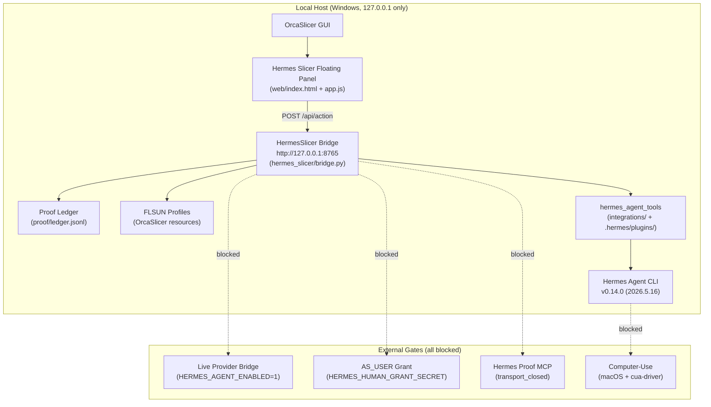

# Agent 5: Release Completion Audit Report
Date: 2026-05-17
Auditor: Claude Agent (release-completion)

## 1. Summary

**Overall verdict: NOT tag-ready.** All local gates pass. Four external gates remain blocked and are consistently documented across all status files. No contradictions found between ROADMAP.md, ACTION_PLAN.md, TASKS.md, V1_STATUS.md, and V1_RELEASE_CHECKLIST.md. No stale completeness claims exist. Three meaningful test coverage gaps and three documentation gaps exist but do not block the tag on their own. The single most actionable unblocking item is an owner-decision record for the four accepted blockers.

Branch: `claude/hopeful-pike-fb6838`. Clean working tree. Latest commits: dd14568, bad139d, b07fc89, 80c5892, 218f100.

---

## 2. Contradictions Between Status Documents

**None found.** All five status documents are internally consistent. The four blocked gates are identified and described identically across all documents. `proof/runtime/v1-release-checklist.json` matches `V1_RELEASE_CHECKLIST.md` exactly.

**Minor observation (not a contradiction):** ROADMAP.md P0 gate 5 still contains "With an active Hermes install: `hermes plugins enable hermes-slicer`" as conditional future phrasing, but the JSON proof shows the plugin is already enabled (`enabled: true`). The phrasing is slightly stale but does not constitute a false claim.

---

## 3. Missing P0 Items

All four known P0 blockers are consistently represented across all status files:
1. Hermes Proof MCP transport blocked (`codex_mcp_transport_status: "transport_closed"`)
2. Live Hermes Agent provider bridge blocked (`HERMES_AGENT_ENABLED=1` not set)
3. Bounded AS_USER grants blocked (`HERMES_HUMAN_GRANT_SECRET` missing)
4. Computer-use blocked on Windows (macOS-only gate)

No P0 items found in TASKS.md that are absent from ACTION_PLAN.md or ROADMAP.md.

**Additional finding:** `pyproject.toml` does not declare a `license` field. This is P1 — not a legal blocker for local use, but required before any public package distribution.

---

## 4. Stale Claims

**No stale completeness claims found.** All `[x]` items in TASKS.md and ACTION_PLAN.md are confirmed by proof artifacts:
- Hermes Agent `v0.14.0 (2026.5.16)` confirmed by `version.matches_expected: true`
- Plugin smoke confirmed by `isolated_active_project_plugin_harness.status: "passed"`
- No project-owned file claims live Hermes Agent connectivity — `live_connectivity_claimed: false`
- Clean-clone confirmed by `clean_clone_rehearsal_passed: true`
- FLSUN T1/V400/S1 confirmed by `flsun-profile-inventory.json` status `passed`

---

## 5. Tag Readiness Gaps

## P0: Four External Gates Remain Blocked — Owner Decision Record Required
- Status: blocked (needs external credential) + open (needs owner record)
- Evidence: `proof/runtime/v1-release-checklist.json` → `tag_readiness.ready: false`, `external_gates.blocked` lists all four gates. `V1_RELEASE_CHECKLIST.md` says "explicitly accepted as release-blocking owner decisions" but no such written record exists anywhere in the repo.
- Why it matters: The tag cannot be created truthfully without either satisfying the gates or recording an explicit owner acceptance decision with rationale.
- Codex next action: Add an `## Owner Acceptance Decisions` section to `V1_RELEASE_CHECKLIST.md` with one entry per blocked gate: gate name, rationale for accepting as release-blocker, and owner name/date. Re-run `scripts/write_v1_release_checklist.py` to generate an updated JSON with `owner_decisions_recorded: true`.
- Release impact: blocks tag — this is the last local gate standing between current state and a truthful V1 tag.

## P1: `pyproject.toml` Missing `license` Field
- Status: open — needs Codex implementation
- Evidence: `pyproject.toml` — no `license` key in `[project]` table.
- Why it matters: Required before any public package distribution to PyPI or `pip install` from VCS. `LICENSE` file exists; pyproject.toml just needs to reference it.
- Codex next action: Add `license = {text = "AGPL-3.0-only"}` to `[project]` table in `pyproject.toml`.
- Release impact: polish for local V1; blocks public package distribution.

## P1: ROADMAP.md P0 Gate 5 Plugin-Enable Phrasing Is Stale
- Status: open — stale documentation
- Evidence: ROADMAP.md P0 gate 5 uses conditional future phrasing for `hermes plugins enable hermes-slicer` but the proof JSON shows it already enabled.
- Why it matters: Minor documentation inconsistency; could confuse a reviewer checking gate status.
- Codex next action: Update ROADMAP.md P0 gate 5 "With an active Hermes install" block to past tense ("Confirmed active: hermes-slicer is enabled per hermes-plugin-smoke.json").
- Release impact: documentation only.

---

## 6. Test Coverage Analysis

33 tests across 6 test files. Coverage is strong for bridge safety, plugin registration, UI branding, and API contract drift.

**File summary:**
- `tests/test_bridge_core.py` — bridge bind, action routing, CORS, health endpoint
- `tests/test_hermes_integration.py` — plugin wiring, hermes_agent_bridge_gate, proof MCP
- `tests/test_proof_validation.py` — proof file existence and basic validation
- `tests/test_submodule_stack.py` — submodule pin and integrity
- `tests/test_ui_static.py` — branding, CSS tokens, forbidden text, login form
- `tests/test_api_contract.py` — OpenAPI spec drift against bridge implementation

## P2: No Test for Bridge Public-Bind Prevention Beyond 0.0.0.0
- Status: open — missing coverage
- Evidence: `tests/test_bridge_core.py` only tests `0.0.0.0`. IPv6 all-interfaces (`::`) and LAN addresses (`192.168.x.x`) are not covered.
- Why it matters: A regression allowing `::` would expose the bridge on IPv6 without detection.
- Codex next action: Parameterize the public-bind test with `["0.0.0.0", "::", "192.168.1.1"]`.
- Release impact: polish — closes edge-case security test gap.

## P2: No Test for AS_USER TTL Edge Cases
- Status: open — missing coverage
- Evidence: No test for past-expiry timestamp, exactly-15-minute TTL (boundary), 16-minute TTL (should block), or malformed timestamp string.
- Why it matters: TTL expiry is a security property. A regression in timestamp parsing would be undetected.
- Codex next action: Add `AsUserSessionGateTests` parameterized with: past-expiry → blocked, 15-min → passed, 16-min → blocked, malformed timestamp → blocked.
- Release impact: polish — closes security test gap.

## P2: No Test for Hermes Version Gate Rejecting v0.12
- Status: open — missing coverage
- Evidence: No test feeds `version: "0.12.0"` to the version gate function and confirms `matches_expected: false` and `status: "blocked"`.
- Why it matters: A prefix-match bug could allow a stale v0.12 install to pass the gate.
- Codex next action: Add `ParseHermesVersionTests` covering v0.12.0 rejection and v0.14.0 acceptance.
- Release impact: polish — closes version gate test gap.

## P2: Proof Ledger Tamper-Detection Tests Minimal
- Status: open — minimal coverage
- Evidence: `tests/test_proof_validation.py` has only 1 test (existence check). No tests for null timestamp, non-string action field, or schema violation.
- Why it matters: A tampered ledger entry would not be caught by the current test suite.
- Codex next action: Add 4 tests: valid entry passes, null timestamp fails, missing action field fails, extra secret field is redacted before write.
- Release impact: polish — does not block V1 tag.

## P3: No Clean-Clone Rehearsal Freshness Assertion in Tests
- Status: open — minor gap
- Evidence: No test reads `proof/runtime/clean-clone-rehearsal.json` and asserts `status == "passed"`.
- Why it matters: A stale rehearsal artifact from a previous branch would give false confidence.
- Codex next action: Add `test_clean_clone_rehearsal_passed()` in `tests/test_proof_validation.py`.
- Release impact: documentation only.

---

## 7. Submodule Pinning

**All 9 submodules clean and pinned.**

- `proof/runtime/submodule-stack.json` → `status: "passed"`, `errors: []`
- `BASES.md` covers all 9 submodules with commit, remote, license, and role
- `.gitmodules` confirmed complete by `tests/test_submodule_stack.py`
- `upstream/hermes-agent` → `describe: "v2026.5.16"`, `package_version: "0.14.0"` — matches required version
- No submodule listed in `.gitmodules` is missing from `BASES.md`

---

## 8. License Compliance

**No issues found.**
- `LICENSE`: Full AGPL-3.0 text present and correct.
- `NOTICE`: All 9 upstream submodules documented with license identifiers and file paths.
- No upstream AGPL/GPL implementation found copied into `hermes_slicer/`, `integrations/`, `web/`, or `scripts/`.
- **Gap**: `pyproject.toml` missing `license = {text = "AGPL-3.0-only"}` (P1, see section 5 above).

---

## 9. Post-V1 Roadmap Completeness

Six P1 items in ROADMAP.md. Two need clarification:

## P2: MCP stdio Server Item Underdefined
- Status: open — needs clarification
- Evidence: ROADMAP.md P1: "Add a true MCP stdio server backed by `upstream/mcp-python-sdk`." No target protocol, tool list, entry point, or test strategy specified.
- Why it matters: Codex cannot implement this without a design note.
- Codex next action: Add design note to ROADMAP.md P1: "stdio JSON-RPC 2.0 transport, 13 bridge actions as tools, entry point `python -m hermes_slicer.mcp_server`, register with `hermes mcp add hermes-slicer-proof --command python --args -m hermes_slicer.mcp_server`."
- Release impact: documentation only for V1; blocks MCP gate unblocking for V2.

## P2: Azure TTS P1 Item Should Reference Existing Gate
- Status: open — stale description
- Evidence: `tts.speak` action with Azure gating already exists in `bridge.py` and `hermes_agent_tool.py`. The P1 item implies it needs to be built when it actually needs live credentials + playback + proof artifact.
- Why it matters: Codex might build a duplicate implementation instead of completing the existing one.
- Codex next action: Update ROADMAP.md P1 Azure TTS item: "Complete `tts_speak` action for live playback — add `HERMES_ENABLE_TTS=1` gate, Azure credential check, and `proof/runtime/hermes-tool-tts_speak.json` proof artifact."
- Release impact: documentation only.

---

## 10. Missing Documentation

## P2: No CONTRIBUTING.md
- Status: open — missing doc
- Evidence: No `CONTRIBUTING.md` found anywhere in the repo.
- Why it matters: No developer setup path from clone to running panel.
- Codex next action: Create `CONTRIBUTING.md` covering prerequisites, install, bridge startup, panel URL, test run, and proof screenshot checkpoints.
- Release impact: documentation only.

## P2: No CHANGELOG.md
- Status: open — missing doc
- Evidence: No `CHANGELOG.md` or `CHANGES.md` found.
- Why it matters: Release notes are absent. V1 is the first external-facing release.
- Codex next action: Create `CHANGELOG.md` with a V1 entry listing local gates completed, external gates blocked, and date.
- Release impact: documentation only.

## P3: README.md Developer Setup Coverage Unknown
- Status: open — needs verification
- Evidence: `README.md` exists and mentions the architecture but may not include full developer setup (`git clone --recurse-submodules`, test invocation, bridge start). Should be verified and supplemented if incomplete.
- Codex next action: Read `README.md` developer section; if `pip install -e .`, `python -m hermes_slicer.bridge`, and test invocation are missing, add them.
- Release impact: documentation only.

## P3: No System Architecture Diagram in README
- Status: open — missing artifact
- Evidence: No Mermaid or ASCII diagram in `README.md`.
- Codex next action: Add the Mermaid diagram from Section 11 below to `README.md` under an "Architecture" heading.
- Release impact: documentation only.

---

## 11. Architecture Diagram: Full V1 Stack (Mermaid)

---

## 12. Codex Next Actions (P0 to P3)

**P0 — blocks tag:**
1. Record owner acceptance decision for each of the four blocked external gates in `V1_RELEASE_CHECKLIST.md` (`## Owner Acceptance Decisions` section with gate name, rationale, owner, date). Re-run `scripts/write_v1_release_checklist.py` to produce updated JSON with `owner_decisions_recorded: true`.

**P1 — important before tag:**
2. Add `license = {text = "AGPL-3.0-only"}` to `[project]` table in `pyproject.toml`.
3. Update ROADMAP.md P0 gate 5 plugin-enable phrasing from conditional future to past-confirmed.

**P2 — useful before tag:**
4. Add parameterized public-bind tests (`::`, `192.168.x.x`) in `tests/test_bridge_core.py`.
5. Add AS_USER TTL edge-case tests (past-expiry, 15-min boundary, 16-min blocked, malformed) in `tests/test_bridge_core.py` or `tests/test_hermes_integration.py`.
6. Add Hermes v0.12 rejection test in `tests/test_bridge_core.py`.
7. Add proof ledger tamper-detection tests in `tests/test_proof_validation.py`.
8. Update MCP stdio server P1 item in ROADMAP.md with protocol/tool list/entry point.
9. Update Azure TTS P1 item in ROADMAP.md to reference existing `tts_speak` action.
10. Create `CONTRIBUTING.md`.
11. Create `CHANGELOG.md` with V1 entry.

**P3 — polish / documentation:**
12. Verify `README.md` has developer setup steps; add if missing.
13. Add architecture diagram to `README.md` (Mermaid from Section 11 above).
14. Add clean-clone rehearsal freshness assertion to `tests/test_proof_validation.py`.
